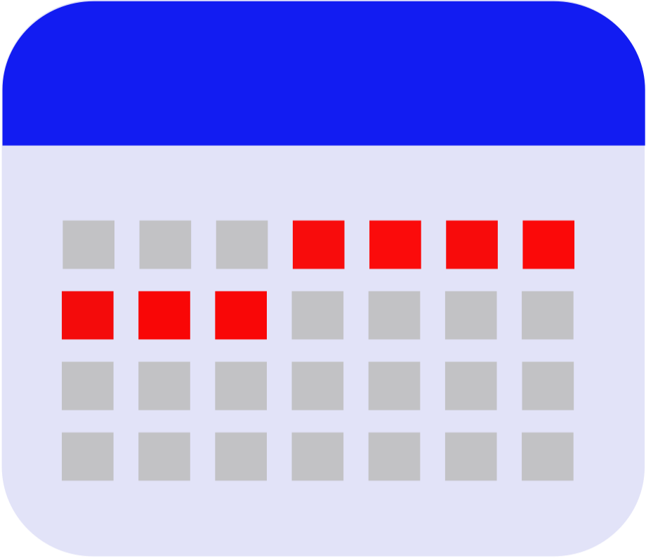

### What do you have to do tomorrow? And the day after? Keep in mind you should go to the doctor on Friday. Next week, remind to send an email to Phil. With **Seven Days** you can **plan** all these actions in a eficient way. 

  

### Also you could add **reminders** at certain time if you need it.

  

### In case you have some activities that are not for this week, you could **schedule** them too.

  

# Download
Download in apple Store!

### [FAQ](./faq.html)

### [Privacy](./privacy.html)

### [Support](./support.html)
